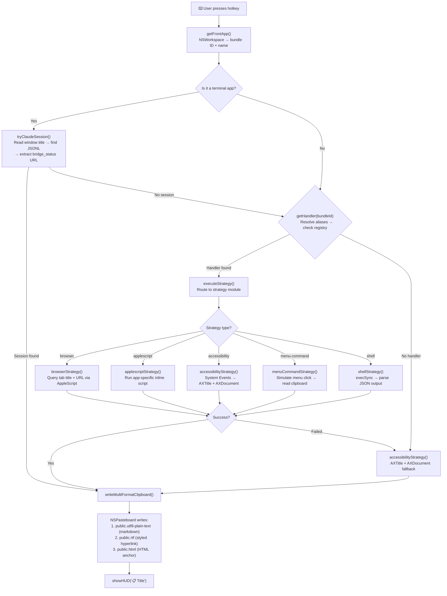

# Universal Copy Link

**One hotkey, any app: copy a markdown `[title](url)` link to the frontmost document, page, or item — with RTF hyperlink on the clipboard too.**

Universal Copy Link is a Raycast extension that gives you a single keyboard shortcut to copy a rich link from whatever app you're currently using. Whether you're in Safari, OmniFocus, Finder, Obsidian, or any of 50+ other apps, it figures out what you're looking at, grabs the title and URL, and puts a properly formatted markdown link on your clipboard — alongside an RTF hyperlink and HTML version so it pastes beautifully into rich text editors, email, and Slack.

---

## Table of Contents

- [What It Does](#what-it-does)
- [Origin Story](#origin-story)
- [Architecture](#architecture)
- [The Five Strategies](#the-five-strategies)
- [Multi-Format Clipboard Pipeline](#multi-format-clipboard-pipeline)
- [Claude Code Session Detection](#claude-code-session-detection)
- [Bundle ID Alias System](#bundle-id-alias-system)
- [The Accessibility Fallback](#the-accessibility-fallback)
- [Commands & Actions](#commands--actions)
- [Supported Apps](#supported-apps)
- [How to Add New App Support](#how-to-add-new-app-support)
- [Development](#development)
- [Permissions Required](#permissions-required)
- [Known Limitations](#known-limitations)
- [File Reference](#file-reference)
- [Links](#links)

---

## What It Does

Press one hotkey in Raycast and get a markdown link for whatever you're looking at:

- **In Safari:** `[Page Title](https://example.com/page)` — the current tab's title and URL
- **In OmniFocus:** `[Task Name](omnifocus:///task/abc123)` — a deep link to the selected task
- **In Finder:** `[document.pdf](file:///Users/you/Documents/document.pdf)` — the selected file
- **In Obsidian:** `[Note Title](obsidian://open?vault=MyVault&file=Note%20Title)` — an Obsidian URI
- **In Spotify:** `[Song — Artist](https://open.spotify.com/track/xyz)` — the currently playing track
- **In Mail:** `[Email Subject](message://%3cmessage-id%3e)` — a `message://` link to the email
- **In a terminal running Claude Code:** `[Session Name](https://claude.ai/code/session_xxx)` — a remote control link to the Claude session

The clipboard gets three formats simultaneously:

| Format | Clipboard Type | Pastes As |
|--------|---------------|-----------|
| **Markdown** | `public.utf8-plain-text` | `[Title](url)` — for markdown editors, code, plain text |
| **RTF** | `public.rtf` | Clickable hyperlink — for Mail, Slack, Notes, Word |
| **HTML** | `public.html` | `<a href="url">Title</a>` — for web apps, Google Docs |

This means you press one key and paste into *any* destination and it just works — markdown in markdown editors, clickable links in rich text apps.

### Key Features

- **57 apps supported** out of the box with app-specific handlers
- **Universal fallback** — even unregistered apps get title extraction via macOS Accessibility API
- **Multi-format clipboard** — markdown, RTF, and HTML written simultaneously
- **Zero UI** — runs as a background command (`no-view` mode), just shows a HUD confirmation
- **Claude Code integration** — detects Claude Code sessions in terminals and links to remote control URLs
- **Setapp/MAS alias resolution** — handles bundle ID variants automatically
- **Strategy pattern architecture** — easy to add new apps

---

## Origin Story

This extension is a rewrite and modernization of a **Keyboard Maestro macro** that Lou had been using for years. The original KM macro did the same thing — detect the frontmost app and copy a markdown link — but it was:

1. **Hard to maintain** — Keyboard Maestro's visual programming model made the branching logic for 40+ apps increasingly unwieldy
2. **Hard to extend** — adding a new app meant navigating a complex macro tree
3. **Not portable** — KM macros don't travel well between machines or share easily
4. **Single-format** — the KM version only copied plain text markdown, not RTF

The Raycast rewrite solved all of these by using a **strategy pattern** where each app type gets its own clean handler, the routing is a simple lookup table, and the clipboard pipeline writes multiple formats. The codebase went from an opaque KM macro to ~400 lines of readable TypeScript + AppleScript.

### Design Decisions

1. **Strategy pattern over if/else chains** — Each app type (browser, AppleScript-scriptable, accessibility-only, menu-driven, shell) gets its own strategy module. Adding a new app is a one-line registry entry, not a new branch in a conditional tree.

2. **Inline AppleScripts over external files** — The AppleScript scripts are embedded as template literals in `src/scripts/index.ts` rather than stored as separate `.applescript` files. This avoids file-path resolution issues in Raycast's bundled extension environment and keeps each script self-contained with its JSON escape helpers.

3. **Multi-format clipboard via NSPasteboard** — Rather than just copying plain text, the extension uses `NSPasteboard` (via AppleScript's Objective-C bridge) to write three clipboard types simultaneously. This means the same copy action produces the right format for any paste destination.

4. **Accessibility as universal fallback** — The `AXTitle` and `AXDocument` accessibility attributes are available on virtually every macOS window. By using these as the fallback strategy, the extension works (at least partially) with *any* app, not just the ones with registered handlers.

5. **Bundle ID as the routing key** — Apps are identified by their macOS bundle ID (e.g., `com.apple.Safari`), not by name. This is stable across localizations and renames. The alias system handles the messiness of Setapp variants, version upgrades, and MAS vs. direct-purchase differences.

6. **No-view mode** — The extension runs as a background command with no UI. You press the hotkey, see a brief HUD confirmation (`📋 Page Title`), and you're done. No windows, no lists, no forms.

---

## Architecture

### How a Keypress Becomes a Link



### File-by-File Breakdown

```
universal-copy-link/
├── src/
│   ├── copy-link.tsx          # Command entry point — orchestrates the full pipeline
│   ├── router.ts              # Gets frontmost app (NSWorkspace), resolves handler
│   ├── handlers.ts            # Handler registry — maps bundle IDs → strategy configs
│   ├── aliases.ts             # Bundle ID alias resolution (Setapp, versions, MAS)
│   ├── clipboard.ts           # Multi-format clipboard writing via NSPasteboard
│   ├── claude-session.ts      # Claude Code session detection in terminals
│   ├── scripts/
│   │   └── index.ts           # Inline AppleScript registry (30+ app-specific scripts)
│   └── strategies/
│       ├── index.ts            # Strategy router — dispatches to the right module
│       ├── browser.ts          # Browser strategy — queries tab title + URL
│       ├── applescript.ts      # AppleScript strategy — runs inline scripts
│       ├── accessibility.ts    # Accessibility strategy — AXTitle + AXDocument
│       ├── menu-command.ts     # Menu command strategy — simulates menu clicks
│       └── shell.ts            # Shell strategy — runs CLI commands
├── assets/
│   └── command-icon.png       # Raycast command icon
├── package.json               # Extension metadata, commands, dependencies
├── tsconfig.json              # TypeScript configuration
└── eslint.config.mjs          # ESLint 9 flat config
```

### The Pipeline in Detail

**Step 1: Identify the front app** (`router.ts`)

Uses `NSWorkspace.sharedWorkspace().frontmostApplication()` via AppleScript's Objective-C bridge to get the bundle ID and localized name of whatever app is in front. This is fast and doesn't require accessibility permissions.

**Step 2: Check for Claude Code sessions** (`claude-session.ts`)

If the front app is a terminal (Ghostty, Terminal.app, iTerm2), the extension first tries to detect an active Claude Code session. It reads the terminal's window title to extract the working directory, maps that to Claude's project folder, finds the most recent `.jsonl` session file, and looks for a `bridge_status` URL. If found, you get a direct remote control link to the Claude session.

**Step 3: Resolve handler** (`router.ts` + `aliases.ts` + `handlers.ts`)

The bundle ID is run through the alias map (to handle Setapp variants, version differences, etc.) and then looked up in the handler registry. The registry returns a `HandlerConfig` that specifies which strategy to use and any strategy-specific parameters.

**Step 4: Execute strategy** (`strategies/`)

The strategy module runs the appropriate method to extract a title and URL from the frontmost app. If the registered strategy fails, the system falls back to the accessibility strategy.

**Step 5: Write to clipboard** (`clipboard.ts`)

The `LinkResult` (title + URL) is formatted as markdown, converted to HTML, then the HTML is converted to RTF via `NSAttributedString`. All three formats are written to `NSPasteboard` simultaneously.

**Step 6: Show confirmation** (`copy-link.tsx`)

A Raycast HUD toast shows `📋 Title` (truncated to 50 characters) to confirm the copy. If something went wrong, you see `⚠️ No link available for AppName` or `❌ Copy Link failed: reason`.

---

## The Five Strategies

Each supported app is assigned one of five strategies based on how its title and URL can be extracted.

### 1. Browser Strategy (`browser.ts`)

**Used by:** Safari, Chrome, Edge, Vivaldi, Kagi, Opera, Firefox, Arc

Queries the browser's scripting interface to get the active tab's title and URL. Most Chromium browsers expose `active tab of front window`, while Safari and Kagi use `current tab of front window`. Firefox gets special handling because its AppleScript model is different — it requires UI scripting to get the window title and then queries the URL separately.

**What you get:** The exact page title and URL from the browser's address bar.

```
[How to Build a Raycast Extension](https://developers.raycast.com/basics/getting-started)
```

**Config example:**
```typescript
"com.apple.Safari": { strategy: "browser", tabAccessor: "currentTab" }
"com.google.Chrome": { strategy: "browser", tabAccessor: "activeTab" }
```

### 2. AppleScript Strategy (`applescript.ts` + `scripts/index.ts`)

**Used by:** Finder, Obsidian, OmniFocus, Bear, Drafts, Mail, TextEdit, Spotify, Calendar, Contacts, DEVONthink, Bike, Notes, Preview, and 15+ more

Runs an app-specific AppleScript that's stored as a template literal in `scripts/index.ts`. Each script returns JSON `{"title":"...", "url":"..."}` using helper functions for JSON escaping. This strategy handles apps that have rich scripting dictionaries (Finder, OmniFocus, Mail) as well as apps where we use System Events to read the window title.

**What you get:** Varies by app — could be a deep link (`omnifocus:///task/id`), a URI scheme (`obsidian://open?vault=...`), a file path (`file:///path/to/doc`), or just a title.

```
[Buy groceries](omnifocus:///task/aBcDeFg)
[My Research Note](obsidian://open?vault=Work&file=My%20Research%20Note)
[document.pdf](file:///Users/loudog/Documents/document.pdf)
```

**Config example:**
```typescript
"com.omnigroup.OmniFocus4": { strategy: "applescript", script: "omnifocus.applescript" }
```

### 3. Accessibility Strategy (`accessibility.ts`)

**Used by:** Ghostty, VS Code, Claude Desktop, Terminal, SideNotes, Notion, Slack, Zoom, Luki, iTerm2

Uses the macOS Accessibility API via System Events to read `AXTitle` (window title) and `AXDocument` (associated file/URL) from the frontmost window. This is the **universal fallback** — it works with any app that exposes standard accessibility attributes, which is virtually all of them.

**What you get:** The window title and, if available, a `file://` or `http://` URL from `AXDocument`. Many apps only expose the title.

```
[main.ts — universal-copy-link](file:///Users/loudog/code/raycast/extensions/universal-copy-link/src/main.ts)
```

**Config example:**
```typescript
"com.microsoft.VSCode": { strategy: "accessibility" }
```

**Also serves as the fallback** when:
- No handler is registered for the frontmost app
- A registered handler's strategy fails (the system catches the error and falls through to accessibility)

### 4. Menu Command Strategy (`menu-command.ts`)

**Used by:** Things 3

Simulates clicking a sequence of menu items in the app (e.g., Edit → Share → Copy Link), waits for the clipboard to update, then reads the URL from the clipboard. The title comes from the window title via System Events.

This strategy exists for apps that don't have a scripting dictionary but do have a "Copy Link" menu item.

**What you get:** Whatever URL the app puts on the clipboard via its own Share/Copy Link menu, paired with the window title.

```
[Buy groceries](things:///show?id=abc123)
```

**Config example:**
```typescript
"com.culturedcode.ThingsMac": {
  strategy: "menu-command",
  menuPath: ["Edit", "Share", "Copy Link"],
  titleSource: "windowTitle",
  delay: 300  // ms to wait for clipboard update
}
```

### 5. Shell Strategy (`shell.ts`)

**Used by:** (No apps currently — available for future use)

Runs a shell command via `execSync` and parses the JSON output. This is the escape hatch for apps where the best way to get link data is through a CLI tool or custom script.

**What you get:** Whatever the shell command outputs as `{"title":"...", "url":"..."}`.

**Config example:**
```typescript
"com.example.app": { strategy: "shell", command: "my-link-tool --json" }
```

---

## Multi-Format Clipboard Pipeline

The clipboard module (`clipboard.ts`) is one of the most important pieces of the extension. Instead of just copying plain text, it writes **three formats simultaneously** to `NSPasteboard`:

### How It Works

1. **Markdown plain text** — `[Title](url)` written as `public.utf8-plain-text`
2. **HTML** — `<a href="url">Title</a>` (with styling) written as `public.html`
3. **RTF** — The HTML is converted to RTF via `NSAttributedString.initWithHTML()`, written as `public.rtf`

The conversion uses AppKit's `NSAttributedString` HTML-to-RTF pipeline through AppleScript's Objective-C bridge:

```applescript
use framework "AppKit"

-- Convert HTML to attributed string, then to RTF data
set htmlData to (NSString's stringWithString:htmlStr)'s dataUsingEncoding:NSUTF8StringEncoding
set attrStr to NSAttributedString's alloc()'s initWithHTML:htmlData documentAttributes:(missing value)
set rtfData to attrStr's RTFFromRange:{0, attrStr's |length|()} documentAttributes:{...}

-- Write all three formats to pasteboard
set pb to NSPasteboard's generalPasteboard()
pb's clearContents()
pb's setString:mdLink forType:"public.utf8-plain-text"
pb's setData:rtfData forType:"public.rtf"
pb's setString:htmlStr forType:"public.html"
```

### Why Three Formats?

Different paste targets read different clipboard types:

| Paste Into | Format Used | Result |
|-----------|-------------|--------|
| Markdown editor (Obsidian, VS Code) | `public.utf8-plain-text` | `[Title](url)` |
| Rich text (Mail, Slack, Notes) | `public.rtf` | Clickable "Title" hyperlink |
| Web app (Google Docs, Notion) | `public.html` | Clickable "Title" hyperlink |
| Plain text field | `public.utf8-plain-text` | `[Title](url)` |

The RTF styling uses a subtle gray color (#ACACAC) with Helvetica Neue 13px — this makes pasted links visually clean in rich text contexts without being jarring.

### Multi-Link Support

The `writeMultiLinkClipboard()` function handles cases where multiple items are selected (e.g., multiple files in Finder). It joins them with newlines in markdown and `<br/>` in HTML.

---

## Claude Code Session Detection

When you invoke Copy Link from a terminal app (Ghostty, Terminal.app, or iTerm2), the extension first checks whether that terminal is running a Claude Code session. If it is, instead of just copying the terminal window title, you get a **rich link to the Claude session**.

### How It Works

```
Terminal window title → extract CWD → map to Claude project dir
→ find most recent .jsonl session → extract bridge_status URL
→ look for /rename command → build [Session Name](remote-url)
```

1. **CWD extraction** — Parses the terminal window title for a path. Handles formats like `user@host:~/code/project`, `~/code/project`, `/absolute/path`, or paths embedded in titles.

2. **Project directory mapping** — Converts the CWD to Claude's project directory naming convention (`/Users/loudog/code/project` → `-Users-loudog-code-project`) and looks in `~/.claude/projects/`.

3. **Session file discovery** — Finds `.jsonl` files in the project directory, sorted by modification time (most recent first).

4. **Bridge status extraction** — Reads the first 5 lines of the session file looking for a `bridge_status` entry with a `url` field — this is the remote control URL.

5. **Session name** — Scans the entire file for `/rename` commands. If found, uses the rename value. Otherwise falls back to the CWD basename.

### What You Get

- **With remote control active:** `[Session Name](https://claude.ai/code/session_xxx)` — a link anyone can use to view the session
- **With session ID but no remote:** `[Session Name](claude --resume abc12345)` — a CLI command to resume
- **No session found:** Falls through to the normal accessibility strategy (window title)

### Recognized Terminal Apps

| Terminal | Bundle ID |
|----------|-----------|
| Ghostty | `com.mitchellh.ghostty` |
| Terminal.app | `com.apple.Terminal` |
| iTerm2 | `com.googlecode.iterm2` |

---

## Bundle ID Alias System

macOS apps can have different bundle IDs depending on how they were installed (Mac App Store vs. direct download vs. Setapp) or what version they are. The alias system (`aliases.ts`) normalizes these to a single canonical ID before looking up handlers.

### Current Aliases

| Variant Bundle ID | Canonical Bundle ID | Reason |
|-------------------|--------------------| -------|
| `com.hogbaysoftware.Bike-setapp` | `com.hogbaysoftware.Bike` | Setapp variant |
| `com.soulmen.ulysses-setapp` | `com.ulyssesapp.mac` | Setapp variant |
| `com.houdah.HoudahSpot-setapp` | `com.houdah.HoudahSpot4` | Setapp variant |
| `com.apptorium.SideNotes-setapp` | `com.apptorium.SideNotes` | Setapp variant |
| `com.omnigroup.OmniFocus3` | `com.omnigroup.OmniFocus4` | Version upgrade |
| `com.omnigroup.OmniFocus3.MacAppStore` | `com.omnigroup.OmniFocus4` | MAS + version |
| `com.omnigroup.OmniPlan3` | `com.omnigroup.OmniPlan4` | Version upgrade |
| `com.reederapp.5.macOS` | `com.reederapp.macOS` | Version upgrade |
| `com.sonnysoftware.bookends2` | `com.sonnysoftware.bookends` | Version upgrade |
| `com.panic.transmit.mas` | `com.panic.Transmit` | MAS variant |

### How to Find an App's Bundle ID

```bash
# For a running app:
osascript -e 'id of app "AppName"'

# For an app on disk:
mdls -name kMDItemCFBundleIdentifier /Applications/AppName.app

# For the frontmost app:
osascript -e 'use framework "AppKit"' -e 'current application'\''s NSWorkspace'\''s sharedWorkspace()'\''s frontmostApplication()'\''s bundleIdentifier() as text'
```

---

## The Accessibility Fallback

The accessibility strategy is the safety net that makes this extension work with **any** macOS app, even ones that aren't in the handler registry.

### Fallback Chain

1. **AXTitle + AXDocument URL** — Best case: the window exposes both a title and a document URL (file path or web URL). You get a full `[title](url)` link.
2. **AXTitle + file:// path** — AXDocument returns a `file://` path. You get `[title](file:///path/to/doc)`.
3. **AXTitle only** — No URL available. You get just `Title` on the clipboard (still useful for quick reference).
4. **App name only** — Nothing found. Returns the app name as a last resort.

### When the Fallback Kicks In

- **No handler registered** — You open an app that nobody thought to add. The accessibility fallback still grabs the window title.
- **Handler fails** — A registered AppleScript might fail if the app updated its scripting dictionary or isn't responding. The system catches the error and falls back to accessibility.

This means you never get *nothing* — there's always at least a window title to copy.

---

## Commands & Actions

### Commands

| Command | Title | Mode | Description |
|---------|-------|------|-------------|
| `copy-link` | Copy Link | `no-view` | Copy a markdown link to the frontmost document or item |

This is a **no-view** command — it runs in the background with no Raycast UI. You assign it a hotkey in Raycast preferences and press that hotkey from any app. The only feedback is a HUD toast showing what was copied.

### Suggested Hotkey Setup

In Raycast → Extensions → Universal Copy Link → Copy Link → set a hotkey. Something like `⌘⇧C` or `⌃⌥C` works well — a hotkey you can reach from anywhere.

### HUD Feedback

| HUD Message | Meaning |
|-------------|---------|
| `📋 Page Title` | Successfully copied a link (title truncated to 50 chars) |
| `⚠️ No link available for AppName` | The extension ran but couldn't extract a useful title or URL |
| `❌ Copy Link failed: reason` | Something went wrong (permissions, app not responding, etc.) |

---

## Supported Apps

Universal Copy Link has registered handlers for **57 apps** (58 handler entries) across 6 categories. See **[SUPPORTED-APPS.md](./SUPPORTED-APPS.md)** for the complete reference table with bundle IDs, strategies, URL types, and example links.

### Quick Summary by Category

| Category | Count | Strategy | Link Quality |
|----------|-------|----------|--------------|
| **Browsers** | 8 | `browser` | Full URL + page title |
| **Tier 1: Daily Use** | 11 | Mixed | Deep links, URIs, file paths |
| **Tier 2: Regular Use** | 11 | Mixed | Deep links, file paths, titles |
| **Tier 3: Carried from KM** | 20 | Mostly `applescript` | Varies — some deep links, many title-only |
| **Hookmark-inspired** | 6 | Mixed | Varies |
| **Terminal** | 1 | `accessibility` | Claude session links when available |

**Plus:** Any unregistered app gets the accessibility fallback (window title + AXDocument if available).

### Link Quality Tiers

Not all apps expose the same level of link data:

- **Deep link** — A URI that opens the specific item in the app (OmniFocus task, Obsidian note, Bear note, Drafts draft, DEVONthink record, Contacts person, Spotify track, Mail message). These are the gold standard.
- **File path** — A `file://` URL to the document on disk (Finder, TextEdit, Preview, Bike, Nova, OmniOutliner, Path Finder, Skim). Useful for local references.
- **Web URL** — An `https://` URL (all browsers, Spotify). The most portable link type.
- **Title only** — Just the window title with no URL (Calendar, Fantastical, Notes, Ulysses, and many Tier 3 apps). Still useful for quick reference or when you just need the document name.

---

## How to Add New App Support

Adding a new app requires 1-3 changes depending on which strategy you use.

### Step 1: Find the App's Bundle ID

```bash
osascript -e 'id of app "AppName"'
```

### Step 2: Choose a Strategy

| If the app... | Use strategy | What you need |
|--------------|-------------|---------------|
| Is a web browser with AppleScript tab access | `browser` | Just know if it uses `currentTab` or `activeTab` |
| Has a scripting dictionary or can be queried via System Events | `applescript` | Write an AppleScript that returns `{"title":"...", "url":"..."}` |
| Exposes window title via Accessibility API (most apps do) | `accessibility` | Nothing — just register it |
| Has a "Copy Link" menu item | `menu-command` | Know the menu path |
| Has a CLI tool that outputs link data | `shell` | Know the command |

### Step 3: Register the Handler

Add an entry to the `handlers` object in `src/handlers.ts`:

```typescript
// For a browser:
"com.example.mybrowser": { strategy: "browser", tabAccessor: "activeTab" },

// For an AppleScript app:
"com.example.myapp": { strategy: "applescript", script: "myapp.applescript" },

// For accessibility-only:
"com.example.myapp": { strategy: "accessibility" },

// For menu command:
"com.example.myapp": {
  strategy: "menu-command",
  menuPath: ["Edit", "Share", "Copy Link"],
  titleSource: "windowTitle",
  delay: 300
},

// For shell command:
"com.example.myapp": { strategy: "shell", command: "myapp-cli --get-link --json" },
```

### Step 4: Write the AppleScript (if using `applescript` strategy)

Add your script to the `scripts` object in `src/scripts/index.ts`:

```typescript
"myapp.applescript": withEscape(`tell application "MyApp"
  set d to front document
  set docName to name of d
  set docID to id of d
  set docURL to "myapp://open/" & docID
  return "{\\"title\\":\\"" & my escapeJSON(docName) & "\\",\\"url\\":\\"" & docURL & "\\"}"
end tell`),
```

**Key rules for AppleScript scripts:**

1. **Always wrap with `withEscape()`** — This appends the JSON escaping helper functions (`escapeJSON` and `replaceText`) that your script needs.

2. **Return JSON format** — Your script must return `{"title":"...", "url":"..."}`. Use `my escapeJSON()` to safely embed dynamic strings.

3. **Handle the "no document" case** — If the app might have no documents open, return empty strings:
   ```applescript
   return "{\\"title\\":\\"\\",\\"url\\":\\"\\"}"
   ```

4. **Use System Events as fallback** — If the app doesn't have a real scripting dictionary, you can use System Events to read the window title:
   ```applescript
   tell application "System Events"
     tell process "MyApp"
       set winTitle to name of front window
     end tell
   end tell
   ```

### Step 5: Add Aliases (if needed)

If the app has Setapp, MAS, or version variants, add entries to `bundleAliases` in `src/aliases.ts`:

```typescript
"com.example.myapp-setapp": "com.example.myapp",
"com.example.myapp.mas": "com.example.myapp",
```

### Step 6: Test

```bash
cd extensions/universal-copy-link
npm run dev
```

Open the target app, press your Copy Link hotkey, and verify:
1. The HUD shows the correct title
2. Pasting into a plain text editor gives you `[Title](url)`
3. Pasting into a rich text editor gives you a clickable hyperlink

### Complete Example: Adding Support for Logseq

```bash
# 1. Find bundle ID
osascript -e 'id of app "Logseq"'
# → "com.electron.logseq"
```

```typescript
// 2. Add to handlers.ts
"com.electron.logseq": { strategy: "applescript", script: "logseq.applescript" },
```

```typescript
// 3. Add script to scripts/index.ts
"logseq.applescript": withEscape(`tell application "System Events"
  tell process "Logseq"
    try
      set winTitle to name of front window
    on error
      set winTitle to ""
    end try
  end tell
end tell
return "{\\"title\\":\\"" & my escapeJSON(winTitle) & "\\",\\"url\\":\\"\\"}"
`),
```

That's it — Logseq is now supported. It'll return the window title (which typically includes the page name). If Logseq later adds AppleScript support or a URI scheme, the script can be upgraded to return a proper URL.

---

## Development

### Prerequisites

- **Node.js 22+** (required by Raycast)
- **Raycast** installed on macOS

### Commands

```bash
cd extensions/universal-copy-link

npm install          # Install dependencies
npm run dev          # Start dev mode (hot reload)
npm run build        # Build and validate
npm run lint         # Check for lint errors
npm run fix-lint     # Auto-fix lint errors
npm run publish      # Publish to Raycast Store
```

### Dependencies

| Package | Version | Purpose |
|---------|---------|---------|
| `@raycast/api` | ^1.83.2 | Raycast extension API (showHUD, etc.) |
| `@raycast/utils` | ^1.17.0 | Utilities including `runAppleScript` |

### Testing

There are no automated tests — the extension is tested manually:

1. Run `npm run dev`
2. Open each target app
3. Press the Copy Link hotkey
4. Verify the HUD message and clipboard contents

The best way to verify the clipboard contains all three formats is to paste into different targets:
- **Markdown editor** (Obsidian, VS Code) — should show `[Title](url)`
- **Rich text** (Mail compose, Slack message) — should show a clickable hyperlink
- **Plain text** (Terminal) — should show `[Title](url)`

---

## Permissions Required

| Permission | Where to Enable | Why |
|------------|----------------|-----|
| **Accessibility** | System Settings → Privacy & Security → Accessibility → Raycast | Required for System Events access (reading window titles, AXDocument, simulating menu clicks) |

Most strategies work through AppleScript's `tell application` which doesn't require special permissions. The accessibility strategy and menu-command strategy need the Accessibility permission because they use System Events to query window attributes and simulate clicks.

If Raycast doesn't have accessibility access, you'll see `❌ Copy Link failed` errors for apps that use the accessibility or menu-command strategies.

---

## Known Limitations

1. **Apps without scripting or accessibility** — Some apps (especially Electron apps with custom window management) may not expose `AXTitle` or `AXDocument`. You'll get just the app name.

2. **Title-only apps** — Many Tier 3 apps only return a window title because they don't have scripting dictionaries or URI schemes. The link is `Title` with no URL. This is still useful but not as powerful as a deep link.

3. **Firefox special handling** — Firefox's AppleScript model is different from other browsers. The extension uses UI scripting (which can be fragile) to get the window title and a separate call for the URL.

4. **Menu command timing** — The menu-command strategy has a configurable delay (default 300ms) to wait for the app to update the clipboard after clicking the menu item. If the app is slow, the delay may need to be increased.

5. **Claude session detection** — Requires that the terminal window title contains the CWD (most terminals show this by default). If the terminal is configured to show something else in the title, session detection won't work.

6. **No multi-tab browser support** — Only copies the active/current tab. There's no way to select and copy links from multiple browser tabs at once.

7. **Setapp aliases are manual** — If you install a new Setapp app, you may need to add its alias to `aliases.ts` if the bundle ID differs from the canonical one.

---

## File Reference

| File | Lines | Purpose |
|------|-------|---------|
| `src/copy-link.tsx` | ~80 | Entry point — orchestrates the full pipeline |
| `src/router.ts` | ~38 | Front app detection + handler lookup |
| `src/handlers.ts` | ~205 | Handler registry — all 55 app→strategy mappings |
| `src/aliases.ts` | ~28 | Bundle ID alias resolution |
| `src/clipboard.ts` | ~120 | Multi-format clipboard writer (markdown + RTF + HTML) |
| `src/claude-session.ts` | ~188 | Claude Code session detection in terminals |
| `src/scripts/index.ts` | ~530 | Inline AppleScript registry (30+ scripts) |
| `src/strategies/index.ts` | ~43 | Strategy dispatcher |
| `src/strategies/browser.ts` | ~67 | Browser tab query strategy |
| `src/strategies/applescript.ts` | ~49 | AppleScript execution + JSON parsing |
| `src/strategies/accessibility.ts` | ~63 | AXTitle + AXDocument fallback |
| `src/strategies/menu-command.ts` | ~79 | Menu click simulation strategy |
| `src/strategies/shell.ts` | ~28 | Shell command execution strategy |

---

## Links

- **Raycast Extension Development**: https://developers.raycast.com/basics/getting-started
- **Raycast API Reference**: https://developers.raycast.com/api-reference
- **AppleScript Language Guide**: https://developer.apple.com/library/archive/documentation/AppleScript/Conceptual/AppleScriptLangGuide/
- **NSPasteboard Documentation**: https://developer.apple.com/documentation/appkit/nspasteboard
- **Accessibility API (AX)**: https://developer.apple.com/documentation/applicationservices/accessibility
- **Hookmark** (inspiration for some app support): https://hookproductivity.com

---

*Built with Claude Code. Last updated: March 2026.*
